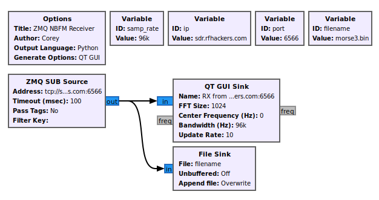
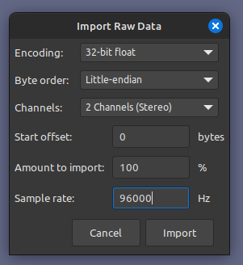
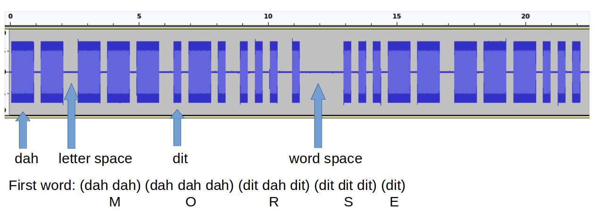
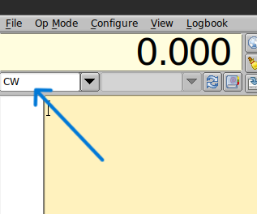
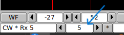
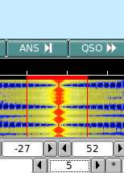
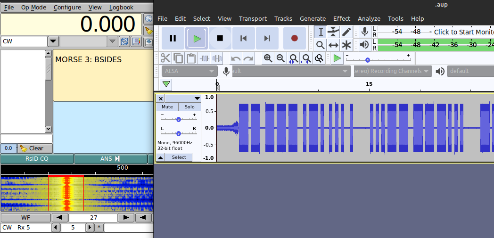

# Morse Code Challenges

There was a set of five morse code challenges. Four were available online, and one was on site only. Challenges use basically the same set techniques to solve.

## Aquire

The kind folks of RFHS provide a few gnuradio templates to get participants started. As is, the gr template will use zqm to connect to a server:port combo and show and play the signal. I added a file sink for IQ file creation and removed the filters and audio sink. Audio was not great during live capture due to latency.

You'll want to change the port and filename variables.



## Playback

You will want something to play back the capture. Of corse there is gnuradio. I had trouble getting good audio signal from gnuradio. Probably because I don't know what I'm doing yet.

Gqrx works well with the IQ files produced by gnuradio. Audacity can handle the IQ files, just have to import them as raw data (File -> Import -> Raw Data). MAke sure to set the sample rate to 96000. Also, since this is complex32 data samples, set the sample type to float32, and select 2 channels for input.



The nice thing about  using audacity is you can trim the collection to just the signal - leave a couple seconds on either end. You can also scrub forward and backward through the signal. I also mixed the two channel stereo down to mono and exported thje result to a wav file.

## Decode

If you know morse code, excellent!

Otherwise, you can manually decode the dits and dahs by inspection, or use something like multimon-ng or fldigi.

### Manual Decode

To manually decode, I find Audacity to work well. That - along with concentration and an online decoder tool.



### Fldigi

Fldigi was very usefull for many of the challenges. It takes some tuning to get right, but worked well.  For these challenges, you need to set the words per minute (WPM).

Start by opening the capture for playback. I used both Gqrx and Audacity with success. For this write up I use Audacity.

Notice in the picture above that one word takes about 10 seconds to transmit. That means you'll have somewhere between 4 to 6 WPM.

Open fldigi. You need to set the filter to CW.



Set the WPM to 5 (the loweest setting it seems).



Move the target box to contain the CW signal.



And profit??



## Flags

```bash
MORSE 3: BSIDESLV POOL PARTY IS LIT 
MORSE 4: PROTON BEAMS CREATE A DAZZLING LIGHT SHOW. 
```

## References

- [https://gnuradio.org/](https://gnuradio.org/)
- [https://www.audacityteam.org/](https://www.audacityteam.org/)
- [https://gqrx.dk/](https://gqrx.dk/)
- [https://morsedecoder.com/](https://morsedecoder.com/)
