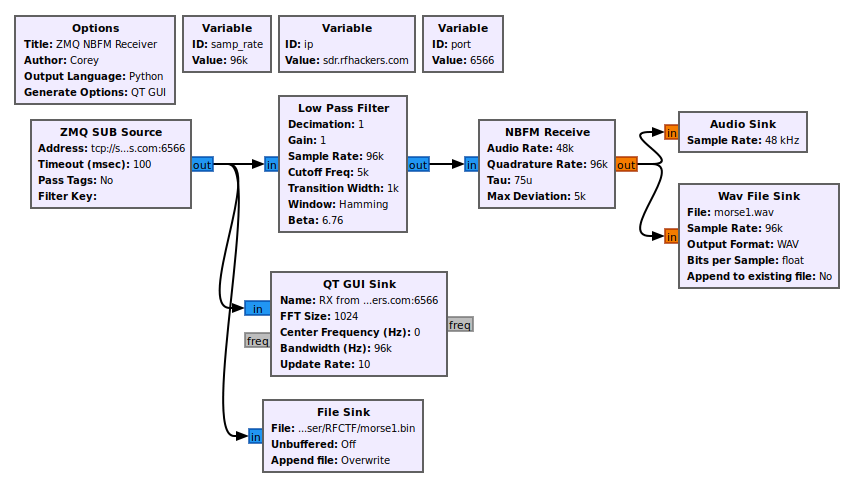

# Morse Code Challenges

There was a set of five morse code challenges. Four were available online, and one was on site only. Challenges use basically the same set techniques to solve.

## Aquire

The kind folks of RFHS provide a few gnuradio templates to get participants started. As is, the gr template will use zqm to connect to a server:port combo and show and play the signal. I added a file sink for IQ and WAV file creation.



## Decode

You will want something to play back the capture. Gqrx works well with the IQ files produced by gnuradio. Most any SDR software should be ok with the WAV files. The IQ files will contain the data at the original captured sample rate of 96 kHz, where as the WAV file will be at 48 kHz. The lower sample rate WAVs will not be an issue here.

Other than Gqrx for the IQ files, Audacity can handle the IQ files, just have to import them as raw data (File -> Import -> Raw Data) with 2 channels.

If you know morse code, excellent!

Otherwise, you can manually decode the dits and dahs by inspection, or use something like multimon-ng or fldigi.

### Manual Decode

To manually decode, I find Audacity to work well. That - along with concentration and an online decoder tool.


### Fldigi

Fldigi was very usefull for many of the challenges. It takes some tuning to get right, but worked well.  For these challenges, you need to set the words per minute (WPM).

Start by opening the capture for playback. I used both Gqrx and Audacity with success. For this write up I use Audacity.

Notice in the picture above that one word takes about 10 seconds to transmit. That means you'll have somewhere between 4 to 6 WPM.

Open fldigi. You need to set the filter to CW.


Set the WPM to 5 (the loweest setting it seems).


Move the target box to contain the CW signal.


And profit??

## Flags

```bash
MORSE 3: BSIDESLV POOL PARTY IS LIT 
MORSE 4: PROTON BEAMS CREATE A DAZZLING LIGHT SHOW. 
```

## References

- [https://gnuradio.org/](https://gnuradio.org/)
- [https://www.audacityteam.org/](https://www.audacityteam.org/)
- [https://gqrx.dk/](https://gqrx.dk/)
- [https://morsedecoder.com/](https://morsedecoder.com/)
